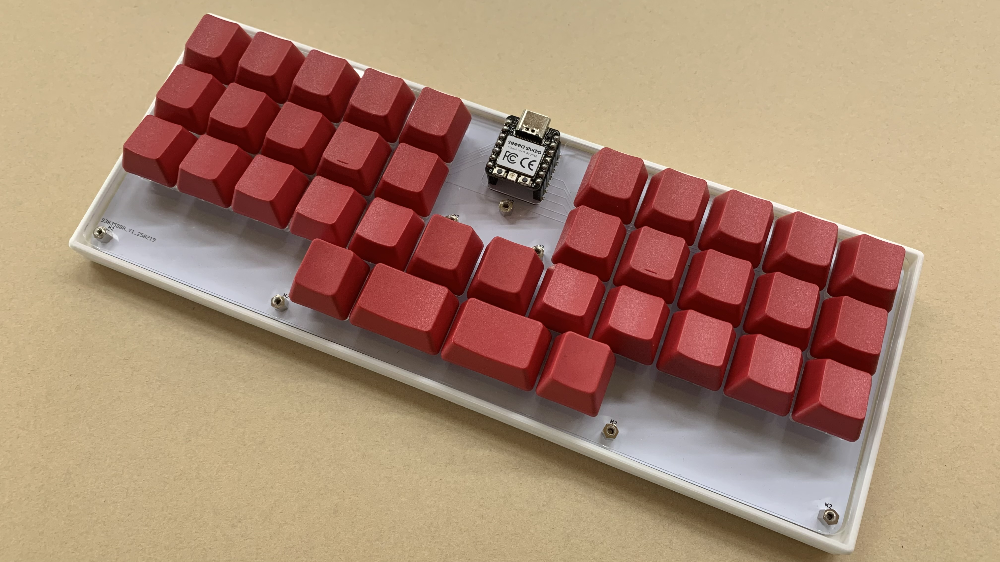

# hands
**hands** is a keyboard which has 36 keys in total. I had been struggling with touch typing on QWERTY + row staggered keyboards. They are literally inefficient to type with, especially special keys like `ESC`, `Shift`, `Ctrl`, `Back Space`, `Enter/Return` and arrow keys. I had to forcely extend my fingers or move my hands. That's very annoying and tiring. **hands** solves this problem with split thumb keys and "Tap and Hold".

